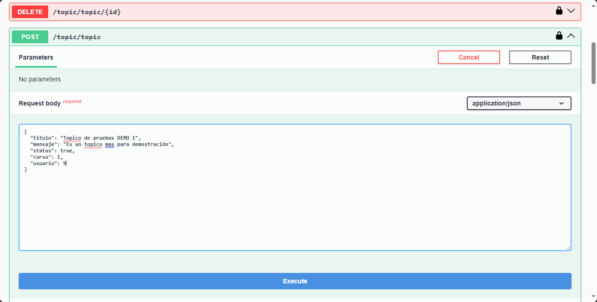

# Challengue Foro-Hub  -  Alura

---


## Descripción del proyecto


**ForoHub** es una aplicación de backend diseñada para facilitar la creación y gestión de foros en línea. Permite a los usuarios registrarse, crear publicaciones o topicos, comentar en topicos. Con un enfoque en la usabilidad y la escalabilidad, ForoHub ofrece una API REST que se integra fácilmente con aplicaciones frontend y móviles.

---

### Características

- **Gestión de usuarios**: Registro, inicio de sesión y gestión de perfiles de usuario.
- **Publicaciones**: Creación, edición y eliminación de publicaciones en foros.
- **Comentarios**: Los usuarios pueden comentar en publicaciones.
- **Búsqueda**: Funcionalidad de búsqueda para encontrar temas y publicaciones fácilmente.

### Tecnologías

- **Lenguaje**: Java
- **Framework**: Spring Boot
- **Base de datos**: MySQL
- **Autenticación**: Auth2 + JWT (JSON Web Token)
- **Documentación**: Swagger

### Instalación

1. Clona el repositorio:
   ```bash
   git clone https://github.com/juanmedina100/Challengue-Foro-Hub-BackEnd.git
   ```

2. Navega al directorio del proyecto:
   ```bash
   cd Challengue-Foro-Hub-BackEnd
   ```

3. Configura la base de datos en `application.properties`.

### Uso

Para interactuar con la API, utiliza herramientas como Postman o cURL. A continuación, algunos endpoints disponibles:

### EndPoint publicos (autenticación e inicio de sesión)
- `POST /auth/login`: Registrar un nuevo usuario.
- `POST /auth/singup`: Inicio de sesión.

### EndPoint privados (requeren autenticación previa)
### Topicos
- `GET /topic/topics`: Obtienes los topicos almacenados (de los ultimos a los primeros).
- `GET /topic/topic/{id}`: Obtienes un topico almacenado por ID.
- `POST /topic/topic` : Agrega un nuevo topico a la base de datos.
- `PUT /topic/topic/{id}` : Actualiza un topic seleccionado por su ID.
- `DELETE /topic/topic/{id}` : Elimina un topico de la base de datos.

### Respuestas
- `POST /response/response` : Agrega una respuesta a un topico seleccionado.


---

## Capturas de ForoHub
### Esquema de base de datos y relaciones.


Las bases de datos relacionales son cruciales por su capacidad para organizar y manejar datos de manera estructurada, segura y eficiente. Su uso generalizado en diversas industrias es un testimonio de su flexibilidad, robustez y capacidad para satisfacer las necesidades de gestión de datos en entornos complejos.

Seguridad al guardar las contraseñas en la base de datos.


Todas las contraseñas de usuarios en la base de datos se encuentran encriptadas.

### Creando un nuevo usuario.


Al crear el nuevo usuario se genera automaticamcente su Token


### Consulta de información del foro usando el Token

Para consultar desde Swagger

Agregamos nuestro Token generado.

### Topicos del foro

Agregar un nuevo topico a la base de datos:


### Consultando topicos


### Creando una respuesta al topico recien creado


### Mostrando topico recien ingresado (muestra el topico mas reciente)


### Accede a la documentación

Documentación generada por Swagger.

http://localhost:8080/swagger-ui/index.html

¡Esperamos que disfrutes usando el ForoHub!